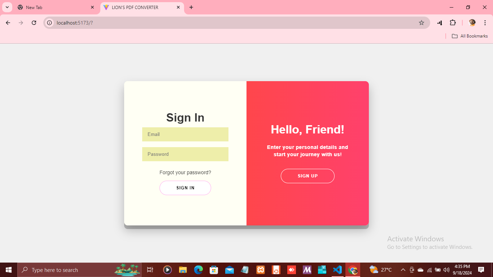

# PDF Converter (Frontend)




A web-based PDF converter tool that allows users to convert different file formats to PDF.

## Features

- Simple drag-and-drop interface.
- Convert images, text, and documents to PDF.

## Technologies Used

- **React.js**
- **Vite** for fast development and build.
- **Styled-components** for UI styling.

## Setup and Installation

### Prerequisites

Make sure you have the following installed:

- [Node.js](https://nodejs.org/) (v14.x or above)
- [Git](https://git-scm.com/)

### Steps

1. Clone the repository:

   ```bash
   git clone <repository-url>
   cd pdf-converter-frontend

   # Install dependencies:

   npm install
   npm run dev

   Project Structure:

   pdf-converter-frontend/
   ├── src/
   │   ├── components/     # React components
   │   ├── pages/          # Page views
   │   ├── styles/         # Styled components and global styles
   │   └── App.jsx         # Main entry file
   ├── public/             # Static assets
   └── README.md
   ```

Contributing:

Feel free to contribute by forking this repository and submitting pull requests.

# git checkout -b your-feature-branch

# git commit -m "Added some feature"

Push your branch and create a pull request.
